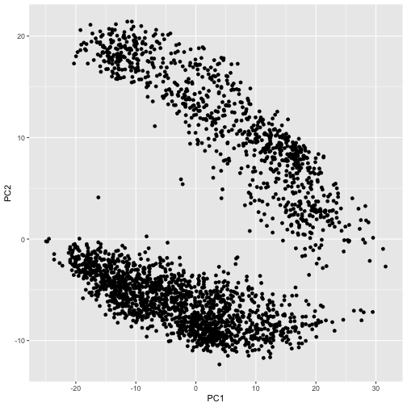

<!-- README.md is generated from README.Rmd. Please edit that file -->


# HCAmtxzip

<!-- badges: start -->
<!-- badges: end -->

This package is not mature.

This package implements tools to access and manipulate Human Cell
Atlas '.mtx.zip' archives describing single cell expression
studies. The focus is on the pre-computed matrices available by
navigating projects on the Human Cell Atlas Data Portal [project
summary page][hca_projects].

[hca_projects]: https://data.humancellatlas.org/explore/projects

## Installation

To install this package and its dependencies, use BiocManager


```r
if (!requireNamespace("BiocManager", quietly = TRUE))
    install.packages("BiocManager", repos = "https://cran.r-project.org")

BiocManager::install("mtmorgan/HCAmtxzip")
```

## Discovery and import

Load the package and find available project titles for which
pre-computed mtx.zip archives are available


```r
suppressPackageStartupMessages({ library(HCAmtxzip) })
dd <- available("mtx.zip")
dd
## # A tibble: 13 x 5
##    projectTitle               entryId        hits      size path                
##    <chr>                      <chr>          <list>   <dbl> <chr>               
##  1 A single-cell reference m… 4a95101c-9ffc… <named… 4.94e8 https://data.humanc…
##  2 A single-cell transcripto… 8185730f-4113… <named… 1.24e8 https://data.humanc…
##  3 Assessing the relevance o… 005d611a-14d5… <named… 3.23e8 https://data.humanc…
##  4 Census of Immune Cells     cc95ff89-2e68… <named… 2.39e9 https://data.humanc…
##  5 Dissecting the human live… 4d6f6c96-2a83… <named… 1.67e8 https://data.humanc…
##  6 Ischaemic sensitivity of … c4077b3c-5c98… <named… 2.29e9 https://data.humanc…
##  7 Profiling of CD34+ cells … 091cf39b-01bc… <named… 2.54e8 https://data.humanc…
##  8 Reconstructing the human … f83165c5-e2ea… <named… 1.32e9 https://data.humanc…
##  9 Single cell profiling of … 116965f3-f094… <named… 6.49e7 https://data.humanc…
## 10 Single cell transcriptome… cddab57b-6868… <named… 6.24e7 https://data.humanc…
## 11 Single-cell RNA-seq analy… 2043c65a-1cf8… <named… 7.67e7 https://data.humanc…
## 12 Spatio-temporal immune zo… abe1a013-af7a… <named… 5.22e8 https://data.humanc…
## 13 Structural Remodeling of … f8aa201c-4ff1… <named… 1.41e8 https://data.humanc…
```

Find the smallest archive


```r
dd %>%
    filter(size == min(size))
## # A tibble: 1 x 5
##   projectTitle                entryId        hits      size path                
##   <chr>                       <chr>          <list>   <dbl> <chr>               
## 1 Single cell transcriptome … cddab57b-6868… <named… 6.24e7 https://data.humanc…
```

Download, unzip, and import the archive into _R_; the download is
cached (using [BiocFileCache][]) so the download is only necessary
once. The imported data is represented as a [SingleCellExperiment][],
a data structure at the heart of _Bioconductor_ packages
[orchestrating single cell analysis][osca]. The `dim` output shows
that there are 58347 features assayed across 2544 cells.

[BiocFileCache]: https://bioconductor.org/packages/BiocFileCache
[SingleCellExperiment]: https://bioconductor.org/packages/SingleCellExperiment
[osca]: https://osca.bioconductor.org


```r
sce <- 
    filter(dd, size == min(size)) %>%
    import_mtxzip(path, verbose = TRUE)
## download
## unzip
## rowData
## colData
## assays
## dim: 58347 2544
## SingleCellExperiment

sce
## class: SingleCellExperiment 
## dim: 58347 2544 
## metadata(0):
## assays(1): counts
## rownames(58347): ENSG00000000003 ENSG00000000005 ... ENSG00000284747
##   ENSG00000284748
## rowData names(8): V2 V3 ... V8 V9
## colnames(2544): 00ca0d37-b787-41a4-be59-2aff5b13b0bd
##   0103aed0-29c2-4b29-a02a-2b58036fe875 ...
##   fdb8ed17-e2f0-460a-bb25-9781d63eabf6
##   fe0d170e-af6e-4420-827b-27b125fec214
## colData names(43): genes_detected file_uuid ...
##   analysis_protocol.protocol_core.protocol_id
##   analysis_working_group_approval_status
## reducedDimNames(0):
## spikeNames(0):
## altExpNames(0):
```

The figure below provides a schematic view of the SingleCellExperiment
-- there is feature x cell matrix of counts, with row and column
annotations.

![sce][sce_image]

[sce_image]: https://raw.githubusercontent.com/Bioconductor/SummarizedExperiment/master/vignettes/SE.svg?sanitize=true

The object contains a matrix of feature x sample counts, and it is easy
to find, e.g., that about 92\% the cells in the matrix are zeros.


```r
mean(assay(sce) == 0)
## [1] 0.9227145
```

Information about each feature can be extracted with `rowData(sce)`,
and about each cell with `colData(sce)`; it is often convenient to work
with this data using the 'tidy' framework, with `rowTibble()` and
`colTibble()` providing relevant access


```r
colTibble(sce)
## # A tibble: 2,544 x 43
##    genes_detected file_uuid file_version total_umis emptydrops_is_c… barcode
##             <int> <chr>     <chr>        <lgl>      <lgl>            <lgl>  
##  1           6924 6770c8ea… 2019-05-15T… NA         NA               NA     
##  2           3171 68efbcbe… 2019-05-30T… NA         NA               NA     
##  3           3838 209d615a… 2019-05-14T… NA         NA               NA     
##  4           4111 143a7005… 2019-05-14T… NA         NA               NA     
##  5           5834 45e82c84… 2019-05-14T… NA         NA               NA     
##  6           2564 cb0b32b2… 2019-05-14T… NA         NA               NA     
##  7           3152 2b5338c5… 2019-05-14T… NA         NA               NA     
##  8           6375 66515cc6… 2019-05-14T… NA         NA               NA     
##  9           4650 45e89c83… 2019-05-14T… NA         NA               NA     
## 10           4420 476dc6ce… 2019-05-14T… NA         NA               NA     
## # … with 2,534 more rows, and 37 more variables:
## #   cell_suspension.provenance.document_id <chr>,
## #   specimen_from_organism.provenance.document_id <chr>,
## #   derived_organ_ontology <chr>, derived_organ_label <chr>,
## #   derived_organ_parts_ontology <chr>, derived_organ_parts_label <chr>,
## #   cell_suspension.genus_species.ontology <chr>,
## #   cell_suspension.genus_species.ontology_label <chr>,
## #   donor_organism.provenance.document_id <chr>,
## #   donor_organism.human_specific.ethnicity.ontology <chr>,
## #   donor_organism.human_specific.ethnicity.ontology_label <chr>,
## #   donor_organism.diseases.ontology <chr>,
## #   donor_organism.diseases.ontology_label <chr>,
## #   donor_organism.development_stage.ontology <chr>,
## #   donor_organism.development_stage.ontology_label <chr>,
## #   donor_organism.sex <chr>, donor_organism.is_living <chr>,
## #   specimen_from_organism.organ.ontology <chr>,
## #   specimen_from_organism.organ.ontology_label <chr>,
## #   specimen_from_organism.organ_parts.ontology <chr>,
## #   specimen_from_organism.organ_parts.ontology_label <chr>,
## #   library_preparation_protocol.provenance.document_id <chr>,
## #   library_preparation_protocol.input_nucleic_acid_molecule.ontology <chr>,
## #   library_preparation_protocol.input_nucleic_acid_molecule.ontology_label <chr>,
## #   library_preparation_protocol.library_construction_method.ontology <chr>,
## #   library_preparation_protocol.library_construction_method.ontology_label <chr>,
## #   library_preparation_protocol.end_bias <chr>,
## #   library_preparation_protocol.strand <chr>,
## #   project.provenance.document_id <chr>,
## #   project.project_core.project_short_name <chr>,
## #   project.project_core.project_title <chr>,
## #   analysis_protocol.provenance.document_id <chr>, dss_bundle_fqid <chr>,
## #   bundle_uuid <chr>, bundle_version <chr>,
## #   analysis_protocol.protocol_core.protocol_id <chr>,
## #   analysis_working_group_approval_status <chr>
```

Much of the `colData()` is constant across all cells, e.g., all cells
come from the same experiment, so share the same
`project.project_core.project_title`. Use `constant()` to access
these common features, where we learn for instance that the experiment
involves the pancreas islet of Langerhans.


```r
colTibble(sce) %>% 
    constant() %>%
    print(n = Inf)
## # A tibble: 27 x 2
##    column                                value                                  
##    <chr>                                 <chr>                                  
##  1 total_umis                            <NA>                                   
##  2 emptydrops_is_cell                    <NA>                                   
##  3 barcode                               <NA>                                   
##  4 derived_organ_ontology                UBERON:0001264                         
##  5 derived_organ_label                   pancreas                               
##  6 derived_organ_parts_ontology          UBERON:0000006                         
##  7 derived_organ_parts_label             islet of Langerhans                    
##  8 cell_suspension.genus_species.ontolo… NCBITaxon:9606                         
##  9 cell_suspension.genus_species.ontolo… Homo sapiens                           
## 10 donor_organism.diseases.ontology      PATO:0000461                           
## 11 donor_organism.diseases.ontology_lab… normal                                 
## 12 donor_organism.is_living              no                                     
## 13 specimen_from_organism.organ.ontology UBERON:0001264                         
## 14 specimen_from_organism.organ.ontolog… pancreas                               
## 15 specimen_from_organism.organ_parts.o… UBERON:0000006                         
## 16 specimen_from_organism.organ_parts.o… islet of Langerhans                    
## 17 library_preparation_protocol.provena… 3ab6b486-f900-4f70-ab34-98859ac5f77a   
## 18 library_preparation_protocol.input_n… OBI:0000869                            
## 19 library_preparation_protocol.input_n… polyA RNA extract                      
## 20 library_preparation_protocol.library… EFO:0008931                            
## 21 library_preparation_protocol.library… Smart-seq2                             
## 22 library_preparation_protocol.end_bias full length                            
## 23 library_preparation_protocol.strand   unstranded                             
## 24 project.provenance.document_id        cddab57b-6868-4be4-806f-395ed9dd635a   
## 25 project.project_core.project_short_n… Single cell transcriptome analysis of …
## 26 project.project_core.project_title    Single cell transcriptome analysis of …
## 27 analysis_working_group_approval_stat… blessed
```

The `brief()` function extracts the columns that differ between cells,
and shortens column names to the shortest 'word' (delimited by
`[[:punct:]]+`) suffix, as illustrated with


```r
x <- setNames(nm = c("common_prefix.a_title", "common_prefix.a_name"))
HCAmtxzip:::.names_abbreviate(x)
## [1] "title" "name"
```

This can make the column names a little easier to use in an
interactive session.


```r
colTibble(sce) %>%
    brief()
## # A tibble: 2,544 x 16
##    detected file_uuid file_version suspension.prov… from_organism.p…
##       <int> <chr>     <chr>        <chr>            <chr>           
##  1     6924 6770c8ea… 2019-05-15T… 00ca0d37-b787-4… 9c1445a1-7287-4…
##  2     3171 68efbcbe… 2019-05-30T… 0103aed0-29c2-4… 14875995-58ca-4…
##  3     3838 209d615a… 2019-05-14T… 01a5dd09-db87-4… 56b6cd1e-7c2c-4…
##  4     4111 143a7005… 2019-05-14T… 020d39f9-9375-4… a1b35ebb-b79e-4…
##  5     5834 45e82c84… 2019-05-14T… 02583626-682b-4… 1f43dc7a-3f89-4…
##  6     2564 cb0b32b2… 2019-05-14T… 041637f8-d5c9-4… 14875995-58ca-4…
##  7     3152 2b5338c5… 2019-05-14T… 044472bd-588a-4… 67601c53-f042-4…
##  8     6375 66515cc6… 2019-05-14T… 046c1a85-77f7-4… 67601c53-f042-4…
##  9     4650 45e89c83… 2019-05-14T… 04f60cb7-5ced-4… 1f43dc7a-3f89-4…
## 10     4420 476dc6ce… 2019-05-14T… 061f92bf-fcfc-4… 56b6cd1e-7c2c-4…
## # … with 2,534 more rows, and 11 more variables:
## #   donor_organism.provenance.document_id <chr>, ethnicity.ontology <chr>,
## #   ethnicity.ontology_label <chr>, stage.ontology <chr>,
## #   stage.ontology_label <chr>, sex <chr>,
## #   protocol.provenance.document_id <chr>, fqid <chr>, bundle_uuid <chr>,
## #   bundle_version <chr>, protocol_id <chr>
```

## Working with colData

Some exploration suggests that the column
`donor_organism.provenance.document_id` defines each biological
sample, so we see that the experiment consists of 8 individuals with
between 178 and 505 cells per individual.


```r
colTibble(sce) %>%
    brief() %>%
    count(donor_organism.provenance.document_id)
## # A tibble: 8 x 2
##   donor_organism.provenance.document_id     n
##   <chr>                                 <int>
## 1 42e60811-4a08-45db-8db8-579f718f1675    331
## 2 6f1fd690-f44b-414e-ab7e-ea555b84942c    286
## 3 6fff3e7d-416e-4256-b33a-3448127e505e    474
## 4 a2675857-89d2-41a7-9178-f7c821cbc456    272
## 5 d361a5a0-19c0-4d5c-be21-117e93926292    505
## 6 e89af40b-6ef9-4b6a-8b6a-a51d1d72589c    221
## 7 f5b67f76-92f0-4426-aa6c-888b8865c403    277
## 8 fc0c4a2b-af93-42ec-8b68-10f68a1f622a    178
```

There are 6 male and 2 female samples with diverse ethnicity.


```r
count <-
    colTibble(sce) %>%
    brief() %>%
    count(donor_organism.provenance.document_id, sex, ethnicity.ontology_label)
count
## # A tibble: 8 x 4
##   donor_organism.provenance.documen… sex    ethnicity.ontology_label           n
##   <chr>                              <chr>  <chr>                          <int>
## 1 42e60811-4a08-45db-8db8-579f718f1… male   European                         331
## 2 6f1fd690-f44b-414e-ab7e-ea555b849… male   Asian                            286
## 3 6fff3e7d-416e-4256-b33a-3448127e5… female European                         474
## 4 a2675857-89d2-41a7-9178-f7c821cbc… male   European                         272
## 5 d361a5a0-19c0-4d5c-be21-117e93926… male   European                         505
## 6 e89af40b-6ef9-4b6a-8b6a-a51d1d725… male   African American or Afro-Cari…   221
## 7 f5b67f76-92f0-4426-aa6c-888b8865c… female African American or Afro-Cari…   277
## 8 fc0c4a2b-af93-42ec-8b68-10f68a1f6… male   ""                               178
```

The `donor_organism.provenance.document_id` serves as a link to
addition information about the samples. The additional information can
be extracted by querying the HCA DSS. The information is returned as
JSON, which is relatively difficult to deal with in _R_; the
even-less-mature function `.files()` tries to parse this into a
sensible format.


```r
donor <-
    colTibble(sce) %>%
    distinct(donor_organism.provenance.document_id) %>%
    HCAmtxzip:::.files(donor_organism.provenance.document_id)
```

We thus learn the age and cause of death of each individual


```r
donor %>%
    select(provenance.document_id, sex, organism_age, death.cause_of_death)
## # A tibble: 8 x 4
##   provenance.document_id               sex    organism_age death.cause_of_death
##   <chr>                                <chr>  <chr>        <chr>               
## 1 d361a5a0-19c0-4d5c-be21-117e93926292 male   21           anoxia              
## 2 e89af40b-6ef9-4b6a-8b6a-a51d1d72589c male   1            anoxia              
## 3 42e60811-4a08-45db-8db8-579f718f1675 male   5            auto accident       
## 4 6f1fd690-f44b-414e-ab7e-ea555b84942c male   22           head trauma         
## 5 f5b67f76-92f0-4426-aa6c-888b8865c403 female 44           stroke              
## 6 6fff3e7d-416e-4256-b33a-3448127e505e female 38           stroke              
## 7 a2675857-89d2-41a7-9178-f7c821cbc456 male   54           anoxia              
## 8 fc0c4a2b-af93-42ec-8b68-10f68a1f622a male   6            head trauma
```

The information on donor could be joined with the count summary, or
with the entire data set using `left_join()`


```r
left_join(count, donor)
## Joining, by = c("donor_organism.provenance.document_id", "sex")
## # A tibble: 8 x 24
##   donor_organism.… sex   ethnicity.ontol…     n describedBy schema_type
##   <chr>            <chr> <chr>            <int> <chr>       <chr>      
## 1 42e60811-4a08-4… male  European           331 https://sc… biomaterial
## 2 6f1fd690-f44b-4… male  Asian              286 https://sc… biomaterial
## 3 6fff3e7d-416e-4… fema… European           474 https://sc… biomaterial
## 4 a2675857-89d2-4… male  European           272 https://sc… biomaterial
## 5 d361a5a0-19c0-4… male  European           505 https://sc… biomaterial
## 6 e89af40b-6ef9-4… male  African America…   221 https://sc… biomaterial
## 7 f5b67f76-92f0-4… fema… African America…   277 https://sc… biomaterial
## 8 fc0c4a2b-af93-4… male  ""                 178 https://sc… biomaterial
## # … with 18 more variables: biomaterial_core.biomaterial_id <chr>,
## #   biomaterial_core.ncbi_taxon_id <chr>, is_living <chr>, organism_age <chr>,
## #   organism_age_unit.text <chr>, organism_age_unit.ontology <chr>,
## #   organism_age_unit.ontology_label <chr>,
## #   human_specific.body_mass_index <chr>, human_specific.ethnicity.text <chr>,
## #   human_specific.ethnicity.ontology <chr>,
## #   human_specific.ethnicity.ontology_label <chr>, death.cause_of_death <chr>,
## #   development_stage.text <chr>, development_stage.ontology_label <chr>,
## #   development_stage.ontology <chr>, provenance.document_id <chr>,
## #   provenance.submission_date <chr>, provenance.update_date <chr>
all <- left_join(colTibble(sce), donor)
## Joining, by = "donor_organism.provenance.document_id"
```

Similarly detailed information about other aspects of the experiment,
such as contributors, funding, and publications, can be learned by
querying `.files()` with additional document identifiers from
elsewhere in `colData(sce)`. For instance, here is the (truncated, in
the HCA) description of the project.


```r
project <- colTibble(sce) %>%
    distinct(project.provenance.document_id) %>%
    HCAmtxzip:::.files(project.provenance.document_id)
project
## # A tibble: 1 x 12
##   project.provena… describedBy schema_type project_core.pr… project_core.pr…
##   <chr>            <chr>       <chr>       <chr>            <chr>           
## 1 cddab57b-6868-4… https://sc… project     Single cell tra… Single cell tra…
## # … with 7 more variables: project_core.project_description <chr>,
## #   supplementary_links <chr>, insdc_project_accessions <chr>,
## #   geo_series_accessions <chr>, provenance.document_id <chr>,
## #   provenance.submission_date <chr>, provenance.update_date <chr>

pull(project, project_core.project_description) %>%
    strwrap(width = 80) %>%
    cat(sep="\n")
## As organisms age, cells accumulate genetic and epigenetic changes that
## eventually lead to impaired organ function or catastrophic failure such as
## cancer. Here we describe a single-cell transcriptome analysis of 2544 human
## pancreas cells from donors, spanning six decades of life. We find that islet
## cells from older donors have increased levels of disorder as measured both by
## noise in the transcriptome and by the number of cells which display
## inappropriate hormone expression, revealing a transcriptional instability
## associated with aging. By analyzing the spectrum of somatic mutations in single
## cells from previously-healthy donors, we find a specific age-dependent
## mutational signature characterized by C to A and C to G transversions,
## indicators of oxidative stress, which is absent in single cells from human
## brain tissue or in a tumor cell line. Cells carrying a high load of such
## mutations also express higher levels of stress and senescence markers,
## including FOS, JUN, and the cytoplasmic superoxide dismutase SOD1, markers
## previously linked to pancreatic diseases with substantial age-dependent risk,
## such as type 2 diabetes mellitus and adenocarcinoma. Thus, our single-cell
## approach unveils gene expression changes and somatic mutations acquired in
## aging human tissue, and identifies molecular pathways induced by these genetic
## changes that could influence human disease. Also, our results demonstrate the
## feasibility of using single-cell RNA-seq data from primary cells to derive
## meaningful insights into the genetic processes that operate on aging human
## tissue and to determine which molecular mechanisms are coordinated with these
## processes. Examination of single cells from primary human pancreas tissue
```

## Exploratory analysis

To illustrate the first analytic steps enabled by this package, load
the [scater][] (single-cell normalization) and [ggplot2][]
(visualization) packages.

[scater]: https://bioconductor.org/packages/scater
[ggplot2]: https://cran.r-project.org/package=ggplot2


```r
library(scater)
library(ggplot2)
```

Normalize our data; the updated `sce` contains an addition assay `logcounts`.


```r
sce <- logNormCounts(sce) 
```

For an overall gestalt, focus on the 1000 most variable
(statistically informative?) genes


```r
rv = apply(logcounts(sce), 1, var)
keep <- tail(order(rv), 1000)
```

and perform a principle components analysis


```r
pc = prcomp(t(logcounts(sce)[keep,]), scale = TRUE)
```

Visualize the results using the [ggplot2][] package, where each point
represents the log-normalized expression of a cell, reduced to
two-dimensional space.


```r
ggplot(as_tibble(pc$x), aes(PC1, PC2)) + geom_point()
```



It then becomes interesting to identify the factors that separate the
cells into groups.

## Acknowledgements

A portion of this work is supported by the Chan Zuckerberg Initiative
DAF, an advised fund of Silicon Valley Community Foundation.

Research reported in this presentation was supported by the NHGRI and
NCI of the National Institutes of Health under award numbers
U41HG004059, U24CA180996, and U24CA232979. The content is solely the
responsibility of the authors and does not necessarily represent the
official views of the National Institutes of Health.

The following is a summary of software used to produce this document.


```r
sessionInfo()
## R Under development (unstable) (2019-11-05 r77368)
## Platform: x86_64-apple-darwin17.7.0 (64-bit)
## Running under: macOS High Sierra 10.13.6
## 
## Matrix products: default
## BLAS:   /Users/ma38727/bin/R-devel/lib/libRblas.dylib
## LAPACK: /Users/ma38727/bin/R-devel/lib/libRlapack.dylib
## 
## locale:
## [1] en_US.UTF-8/en_US.UTF-8/en_US.UTF-8/C/en_US.UTF-8/en_US.UTF-8
## 
## attached base packages:
## [1] parallel  stats4    stats     graphics  grDevices utils     datasets 
## [8] methods   base     
## 
## other attached packages:
##  [1] scater_1.15.5               ggplot2_3.2.1              
##  [3] HCAmtxzip_0.0.6             dplyr_0.8.3                
##  [5] SingleCellExperiment_1.9.0  SummarizedExperiment_1.17.0
##  [7] DelayedArray_0.13.0         BiocParallel_1.21.0        
##  [9] matrixStats_0.55.0          Biobase_2.47.0             
## [11] GenomicRanges_1.39.1        GenomeInfoDb_1.23.0        
## [13] IRanges_2.21.1              S4Vectors_0.25.0           
## [15] BiocGenerics_0.33.0        
## 
## loaded via a namespace (and not attached):
##  [1] viridis_0.5.1            httr_1.4.1               BiocSingular_1.3.0      
##  [4] bit64_0.9-7              jsonlite_1.6             viridisLite_0.3.0       
##  [7] DelayedMatrixStats_1.9.0 assertthat_0.2.1         highr_0.8               
## [10] BiocFileCache_1.11.2     blob_1.2.0               GenomeInfoDbData_1.2.2  
## [13] vipor_0.4.5              pillar_1.4.2             RSQLite_2.1.2           
## [16] backports_1.1.5          lattice_0.20-38          glue_1.3.1              
## [19] digest_0.6.22            XVector_0.27.0           colorspace_1.4-1        
## [22] Matrix_1.2-17            pkgconfig_2.0.3          zlibbioc_1.33.0         
## [25] purrr_0.3.3              scales_1.1.0             tibble_2.1.3            
## [28] farver_2.0.1             withr_2.1.2              lazyeval_0.2.2          
## [31] cli_1.1.0                magrittr_1.5             crayon_1.3.4            
## [34] memoise_1.1.0            evaluate_0.14            fansi_0.4.0             
## [37] xml2_1.2.2               beeswarm_0.2.3           tools_4.0.0             
## [40] lifecycle_0.1.0          stringr_1.4.0            munsell_0.5.0           
## [43] irlba_2.3.3              compiler_4.0.0           rsvd_1.0.2              
## [46] rlang_0.4.1              grid_4.0.0               RCurl_1.95-4.12         
## [49] BiocNeighbors_1.5.1      rappdirs_0.3.1           bitops_1.0-6            
## [52] labeling_0.3             gtable_0.3.0             codetools_0.2-16        
## [55] DBI_1.0.0                curl_4.2                 R6_2.4.1                
## [58] gridExtra_2.3            knitr_1.26               bit_1.1-14              
## [61] utf8_1.1.4               zeallot_0.1.0            stringi_1.4.3           
## [64] ggbeeswarm_0.6.0         Rcpp_1.0.3               vctrs_0.2.0             
## [67] dbplyr_1.4.2             tidyselect_0.2.5         xfun_0.11
```
